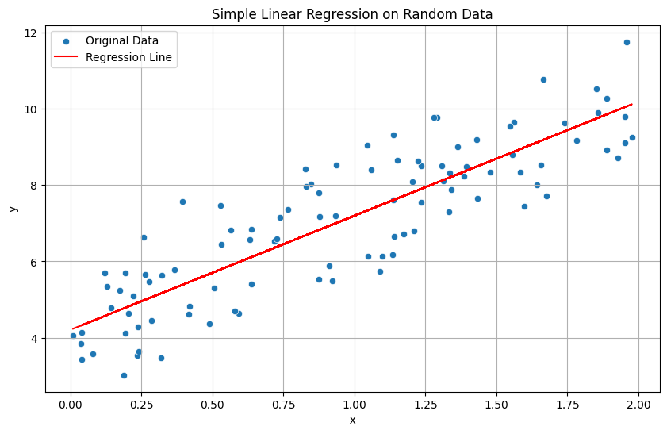

# 100-Days-of-Machine-Leaning
100 Day ML Challenge to learn and implement ML/DL concepts ranging from the basics to more advanced state of the art models. 

# 🚀 100 Days of Machine Learning Challenge

Welcome to my **100 Days of ML** repository! This project is a dedicated, daily commitment to mastering the fundamentals of Machine Learning, Deep Learning, and MLOps from scratch. 

Here, you'll find daily code implementations, mathematical breakdowns, data visualizations, and notes on real-world datasets.

---

## 📊 Challenge Dashboard


### 📌 Core Goals
* **Days 1–30:** Classical Machine Learning (Regression, Classification, Clustering, Ensemble Methods)
* **Days 31–60:** Advanced Data Engineering & Feature Selection
* **Days 61–80:** Deep Learning Fundamentals (Neural Networks, CNNs, RNNs using PyTorch/TensorFlow)
* **Days 81–100:** MLOps, Model Deployment, and Capstone Projects

---

## 📅 Daily Progress Tracker

This log is updated daily with links to code, datasets, and a snapshot of what I learned.

| Day | Topic | Source Code | Key Concepts / Libraries |
| :---: | :--- | :---: | :--- |
| **01** | **Simple Linear Regression** | [💻 Code](./Day_01_Simple_Linear_Regression/Simple_linear_regression.ipynb) | , $R^2$ Score, Mean Squared Error (MSE). |
| **02** | *Coming Soon...* | ⏳ | *Pending update* |
| **03** | *Coming Soon...* | ⏳ | *Pending update* |

---

## 🔍 Day 1 Spotlight: Simple Linear Regression

### 📝 Overview
For Day 1, I built a foundation by implementing a **Simple Linear Regression** model. Rather than just using clean, perfect data, I generated a synthetic dataset incorporating true linear weights combined with random Gaussian noise to mimic real-world unpredictability.

### 📐 The Math Behind It
The model maps a single independent feature $X$ to a continuous dependent target $y$ using the linear equation:

$$y = \beta_0 + \beta_1X + \epsilon$$

Where:
* $\beta_1$ is the **Slope** (Coefficient)
* $\beta_0$ is the **Intercept**
* $\epsilon$ represents random **Residual Noise**

### 📈 Visualizing the Line of Best Fit
The model successfully minimized the residual sum of squares to draw the optimal regression line through the noisy data points:



### 🏆 Key Metrics Achieved
* **Calculated Slope ($\beta_1$):** ~3.00  *(True Value: 3.0)*
* **Calculated Intercept ($\beta_0$):** ~4.00 *(True Value: 4.0)*
* **Evaluation:** Evaluated cleanly using a 80/20 train-test split to ensure zero data leakage.

---

## 🛠️ Local Setup & Installation

If you want to run any of the daily scripts locally, follow these steps:

1. **Clone the repository:**
   ```bash
   git clone [https://github.com/YOUR_USERNAME/100-days-of-ml.git](https://github.com/YOUR_USERNAME/100-days-of-ml.git)
   cd 100-days-of-ml

2. **Create a virtual environment:**
   ```bash
   python -m venv ml_env
   # Activate on Windows:
   ml_env\Scripts\activate
   # Activate on macOS/Linux:
   source ml_env/bin/activate

3. **Install dependencies:**
   ```bash
   pip install numpy pandas scikit-learn bootstrap seaborn matplotlib


## 🤝 Connect & Follow My Journey
** I am actively open to feedback, code reviews, and discussions!

** GitHub: @YOUR_USERNAME

** LinkedIn: Your Name

⭐ If you find this repository helpful for your own learning, please consider leaving a star!
